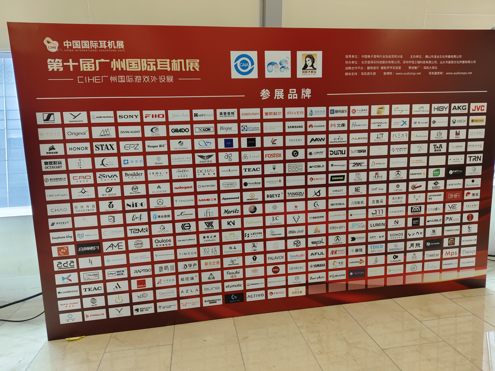
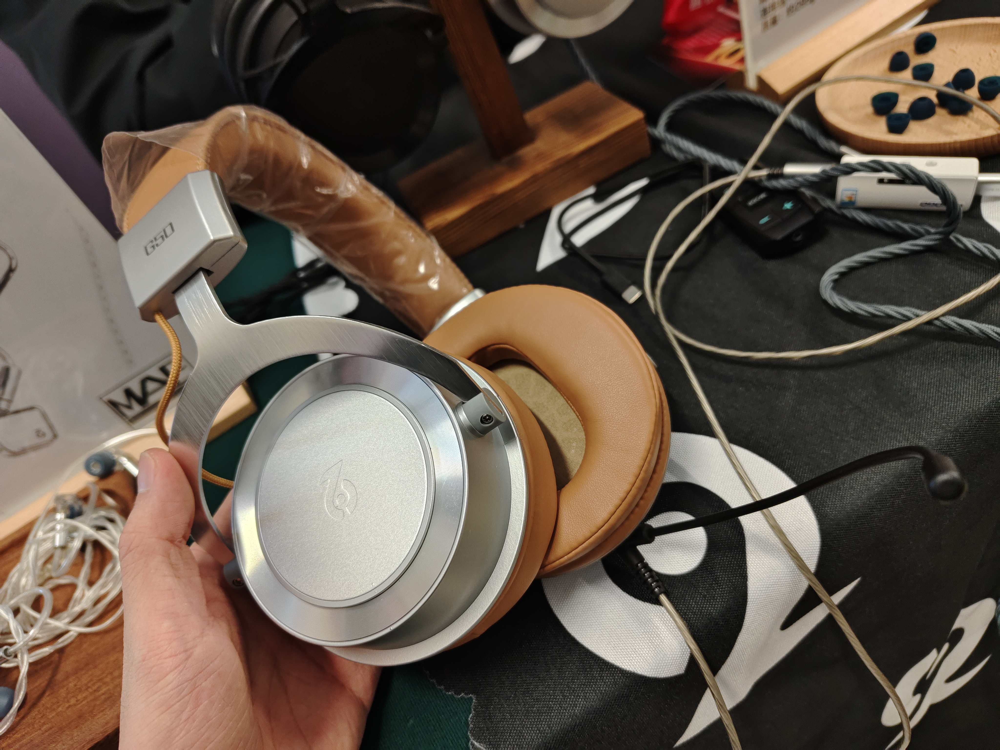
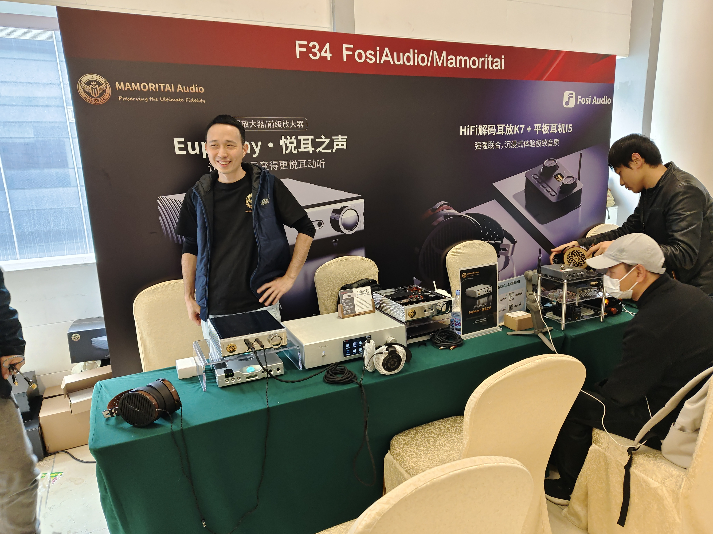
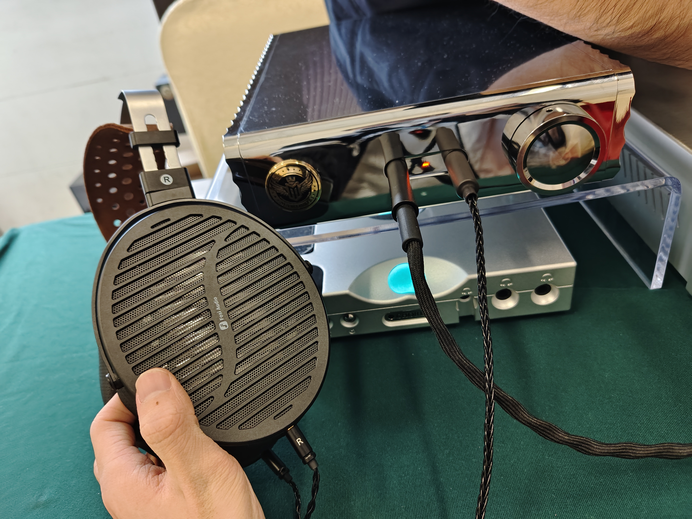
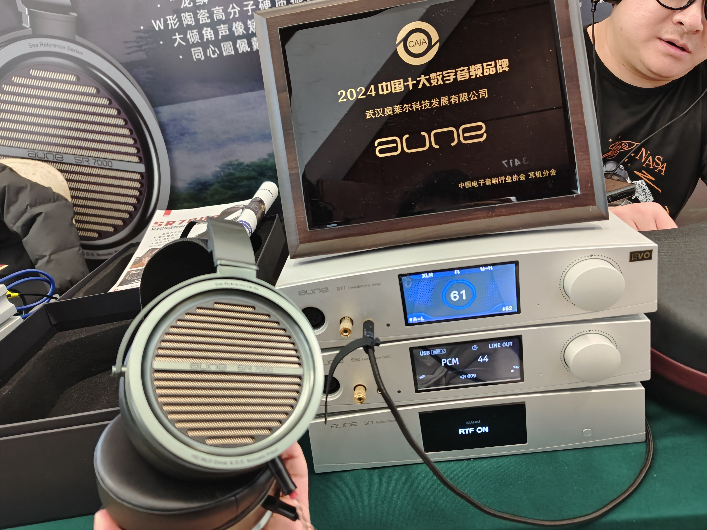

This post recounts my experiences and interviews during the China International Headphone Expo (CIHE) in Guangzhou, tailored for audiophiles interested in HiFi industry. It bridges the information gap between manufacturers and consumers by offering insights rarely known to the general public. The order of manufacturers is arranged in **ascending order** of their influence.

# Hongshu Audio / Binary Acoustics

Hongshu Audio currently offers only one product: the EH1, a full-size electrostatic headphone **priced around 3,000 RMB**, complete with a simple electrostatic amplifier. It's almost always being out of stock. You find some introductions about it here: [_Introducing Four Major Diy Headphones Workshop in China_](https://www.reddit.com/r/headphones/comments/1dqy10m/introducing_four_major_diy_headphones_workshop_in). At the booth of Binary Acoustics, I was surprised to see the EH1 demo unit, which revealed that Binary Acoustics and Hongshu Audio are essentially two brands of one company. As a decent brand rather than a DIY workshop, R&D of Hongshu's electrostatic headphone system is likely supported financially by Binary Acoustics's profit.

When paired with the included amp which barely powers the headphones, I tested the EH1 and noticed an exceptionally flat frequency response in ten seconds. The sound closely adhered to the Harman over-ear 2018 while the bass was a bit lighter. The booth owner confirmed my impressions matched objective measurements. **When subjective perception aligns with objective frequency response, a headphone likely has low nonlinearity**, meaning it delivers Hi-Fi low-distortion sound that's audibly exceptional. The EH1 didn't just impress me with its sound but also its super light weight and stylish ID. Achieving this level of quality for electrostatic headphones at such a cost is remarkable.

Previously, a few overseas audiophiles on Reddit had consulted me about purchasing an EH1. I dissuaded them due to stock shortages and early batches suffering from reliability issues like crackling and channel imbalance. However, the latest EH1 batch is reportedly the finalized version with greatly improved stability. Since overseas aftersales services are expensive and time-consuming, Hongshu wouldn't dare export unless the EH1's durability met high standards. **The EH1's final stable version will launch by year-end**, so stay tuned.

Post-expo, I learned Hongshu is planning to release two more products: the EHA2T electrostatic amp and the EH2 electrostatic headphone, targeted for release in Q2 and Q4 of 2025, priced at approximately 4,000 RMB and 10,000 RMB, respectively. CTO of Hongshu admitted that the EH2 will not offer stellar value for money, but claimed to try their best effort to use premium materials in every possible way to ensure buyers don't feel disappointed.

  
"EH2 priced 10,000 RMB just because we need a 10,000 RMB flagship headphone. I'll do my best not to make my customers feel disappointed. Of course it's too expensive. I'm not happy with the price either."

As for me, I'm set on getting myself an EH1 but might consider using Topping's electrostatic amp instead of the stock unit.

# Sonic Memory

Sonic Memory's recent product, the G50, is a closed-back monitor headphone priced at 299 RMB. It has garnered widespread acclaim and consistently sells out. Initially, I was skeptical that an unheard-of brand could produce a competent full-size headphone at such a low price, but a demo at the expo completely dispelled my doubts. The G50 offers excellent isolation and neutral, accurate sound reproduction. Its only flaw is its somewhat small pads which might feel tight for larger ears. The G50 also features a locking mechanism on its 3.5mm AUX interface, a simple yet secure design that prevents accidental disconnections and keeps the attached microphone firmly in place. Usability is most important in the world of monitor headphones.

The boss of Sonic Memory, nicknamed Dogwhip, explained that they not only produces its own brand but also offers B2B solutions, enabling strong cost control and R&D capabilities. In Dogwhip's words:
"Other manufacturers might struggle to profit from a 299 RMB headphone with G50's quality, but we still ensure reasonable margins... We even developed private molds for G50, investing several hundred thousand
upfront, something small brands wouldn't dare risk. Many brands test the waters with off-the-shelf molds, producing a few dozen units at a time to minimize risk... **Some, including more influencing iem brands, even lack proper acoustic R&D facilities**... For G50, maybe we could sell the mold to those interested... Exporting? We'll surely consider exporting only if domestic demand is met. We significantly underestimated the G50's sales. It sold out very soon despite minimal marketing..."

Dogwhip also elaborated on G50's design, particularly its impressive passive isolation. The headphone achieves this through a fully sealed cup and non-perforated pads. Designing a high-fidelity closed-back headphone is harder because sound wave reflections can damage sound quality. Other similiar products, like FiiO JT1 and HarmonicDyne Black Hole, implement venting to mitigate these issues. Sonic Memory, however, opted for a fully sealed design, carefully selecting materials for the rear cavity cover to optimize acoustic properties. Despite the challenges, G50 boasts an impressively warranty rate.

When asked about future planar headphone plans, Dogwhip revealed they have the capability to produce planar headphones but won't pursue this category for now, as he believes planar headphones have yet to match the "correct" listening experience of dynamic headphones (I disagree with that). Dogwhip also showcased an upcoming product, the GO50, priced at 399 RMB, which features a rotating rear cover to switch between open-back and closed-back modes. There's also a dynamic headphone with wooden cups in development.

Interestingly, I stumbled upon Dogwhip discussing Bluetooth headphones with another audiophile. He showcased a Beats Studio Pro, commending its imaging and sound quality over Sony's XM5, despite its shitty ANC performance. Curious, I asked him whether brands like Bose, Sony, and Apple genuinely hold a competitive edge in flagship ANC Bluetooth headphones or simply leverage their branding to justify higher prices.
"Unfortunately, there is a genuine technological barrier", Dogwhip explained, "Take Apple's AirPods Max ANC chip, it's on par with the scale of the iPhone 4 soc. Even most smartphone manufacturers lack the capability to design something comparable. Domestic brands, meanwhile, rely on Qualcomm's solutions, which, while decent, are nowhere near the level of the Big Three. For now, Sonic Memory has no plans to enter the Bluetooth headphone market."

Sonic Memory's booth was full of fascinating info. **Many thanks to Dogwhip for sharing insights typically reserved for industry insiders.** Transparent communication like this contributes to healthier competition and a better-informed consumer base.

# Fosi Audio / MEMORITAI

I first encountered Fosi Audio at Shenzhen Internal Audio Show (SIAS) in September. However, their representatives at the time were from the marketing department, while I was more interested in technical aspects, so our exchange was limited. After the event, I visited Fosi's headquarters in Shenzhen to learn more about their product roadmap, pricing strategy, and marketing plans. I'll only tell something that I wasn't asked for confidentiality.

At CIHE, Fosi showcased the prototype of their planar magnetic headphone, the i5, for the second time. Initially, I mistook it for a product from Ori Sonic 初心之声 (a Chinese headphone workshop that relies on China National Graphene Innovation Center, I'll introduce at the end of this post) due to their strikingly similar look, and thought Fosi may be a distributor of Ori Sonic. It was not until an operator of Fosi told me before the expo that this headphone was their own product, connecting with the recent news posted in Bilibili by the owner of Ori Sonic, I finally figured out how i5 was born.

Upon clarification, it turns out that Ori Sonic developed a high-performance planar magnetic driver and gave it to his company. Then Fosi bought this driver patent and developed their first headphone i5. Sooner or later it's going to be put to mass production. As the demo units of i5 in expo all had some issues, I didn't critically listen to them, but they did deliver an overall sound which leaned towards a neutral and low-distortion tuning, which I appreciated.

Fosi also unveiled their latest product: K7, a desktop DAC/headphone amp priced at 1,099 RMB. Though its ID resembles a gaming sound card, its main audience remains audiophiles. Sound reproduction performance prioritized above all else. Crappy soundcards like Creative's are not their competitors. According to a staff member, K7 is "Fosi's first premium desktop DAC/headphone amp". Fosi K7 has an extra microphone input and control interface compared to Fiio K7 to serve those who enjoys both HiFi and competitive games which require real-time communications. Many distributors such as GothamPro Audio had expressed interest in K7 at the expo, but Fosi claimed their production capacity is limited for now, so marketing efforts are currently minimal.

Fosi also operates a high-end sub-brand, MEMORITAI, which currently only offers a single-ended headphone amp priced at around 10,000 RMB, Euphony. Euphony's chrome-plated mirror finish and intricate circuitry are impressive, unlike dCS and Soundaware's "HiFi air circuitry". According to [objective measurements of ASR](https://www.audiosciencereview.com/forum/index.php?threads/mamoritai-euphony-hp-amp-review.58247) and the introduction of their stuff members, extraordinary electroacoustic measurement index is not what Euphony is for.

Basicly a waste of R&D and molding investment, my personal opinion.

Overall, Fosi is poised to become another significant force in the global HiFi market. Their excellent cost control, robust R&D and marketing skills position them as a formidable competitor. With plans to diversify into products from CD players to opamp and other components, **Fosi is receiving rare acclaim from both "HiFi technophilics"(科 Hi) and "anti-tech audiophiles"(老烧)** (I must have translated wrong). Based on my shallow knowledge of Fosi's products, I personally believe that Fosi's current analysis and understanding of market needs can be improved. I heard that they have recently hired a new product manager. Emm... I guess that would help.

# Aune

This isn't my first time listening to Aune's headphones, the AR5000 and SR7000. These headphones not only feature an astonishingly advanced ID but also excel in objective acoustic performance and subjective sound quality assessments by audiophiles. The wearing comfort and power demand is also optimal. An audiophile friend of mine, an international student in Russia who couldn't try headphones before buying (China has a lot of place to try headphones, no consumption is required in these place) was persuaded to buy an SR7000 on my recommendation, and he gave it high praise (though he noted its passive noise isolation isn't good).

Aune is a company of audiophiles. I was impressed by their expertise at the expo. I handed a Kennerton Magni and a NAN-7 to one of their staff members at the exhibition, and he immediately noticed that the Magni had a slight channel imbalance which is subtle, especially in noisy environment like the expo. He also provided insightful analysis of the sound characteristics and tuning philosophy of the Magni and NAN-7. Additionally, he introduced me to the "Loong scale" structure used in the SR7000's closed-back design:

**The SR7000's rear cavity employs a dense rigid sound-absorbing structure with varying gaps instead of the traditional foam or sponge-like materials commonly found in closed-back headphones, and as return avoids muffled sound and enhances consistency.** (There might be other factors at play, but I've forgotten the details. Perhaps someone from Aune can add to this in the comments) The result? **The SR7000's soundstage is outstandingly natural, surpassing what most closed-back headphones can achieve.**

The AR5000 and SR7000 both feature a refined tune, primarily stemming from low distortion and relatively flat frequency response. For youth, their first headphones are mostly consumer-grade Bluetooth models or budget earbuds with exaggerated tuning, significant distortion, and a heavy focus on coloration for some specific sound signatures. Even many audiophiles lack direct exposure to live performances or studio monitoring environments, leaving them accustomed to distorted sound. In a market where most HiFi manufacturers rely on coloration to satisfy various music flavors, Aune has taken a contrarian approach with its pure, High-Fidelity tuning idea, a philosophy that's well worth trying for audiophiles seeking authenticity.

I also asked the staff member about their future plans. It turns out they have started working on planar magnetic and electrostatic headphone drivers. However, their next headphone likely won't launch until around Q2 of next year. Personally, I think there's room for discussion about their market strategy, especially after the success of the AR5000 in establishing Aune headphones' reputation for **greater sound, stylish design, less power demand, and high value for money.** Introducing the SR7000 with a higher price point in the 4,000+ RMB range feels debatable. While it's true that developing closed-back dynamic headphones is more challenging than open-back ones, and the SR7000 likely uses higher-grade drivers than its predecessor; but reusing the same ID, front cavity, and molds should help keep production costs manageable. Pricing it 4,000+ RMB might seem steep.

That said, the unfortunate reality is that **there's hardly a closed-back headphone under 10,000 RMB that can match the SR7000 in terms of sound, comfort, or aesthetics.** Flagship closed-back headphones like Z1R and HD820 seem likely to cost more to manufacture than SR7000 due to their ID, but they still fall short in sound quality. Perhaps this is the confidence behind Aune's pricing. Hard to find a competitor in sound quality...

It was quite awkward that the staff member recognized me as the admin who had mercilessly criticized their (or maybe one of their distributers') ridiculous and morally-flawed marketing tactics on Baidu Tieba. This is what happened when I left their booth:

"Fewer criticisms plz."  
"Your products? Nothing to criticize."

# Moondrop

The CEO of Moondrop, nicknamed Watermoon, is truly a celebrity! People always surround him, asking for autographs and photos. Most of the time I was too shy to muster the courage to interrupt and ask questions. 😭

I had quite a lengthy conversation with Watermoon during SIAS. While this time at CIHE, I mostly spoke with Mr. Hou 侯 from Moondrop's marketing department (he's such a humble person). I'll combine my insights from both events into this post.

Since the inception of Moondrop's planar magnetic headphones, these products have faced significant criticism domestically. I remember the first time when I listened to Para, I hadn't yet developed a strong sense of audio aesthetics but was hurrying to write a review. Para left an impression for cramped soundstage and uninspiring sound. After more than a year of diving into the audiophile world, I revisited Moondrop's planar headphones and found myself starting to appreciate their pure and uncolored sound. My assessment evolved from "a dull headphone with no soundstage" to "a flat, authentic reproduction of natural sound"~~, although I still felt no soundstage subjectively~~.

After their first planar headphone, Venus, was criticized for its weight, the follow-up models Para and Cosmo adopted an integrated design for the housing and driver (patent CN218450473U) and reduced some weight. However, the core design philosophy of planar headphones involves super large drivers for increased active area to reduce distortion. This necessitates numerous magnets. As a result, both models currently in production still exceed 500g.

As someone very sensitive to headphone weight, I asked Mr. Hou, "Since there's still a considerable pricing gap between the Para (2,000 RMB) and Cosmo (5,000 RMB), could Moondrop consider releasing a lighter planar headphone by slightly simplifying driver configurations?" His explanation was that cost, sound quality, and weight are mutually exclusive, and the primary goal of their planar lineup is to achieve a high price-to-sound-quality ratio. Inevitably, this requires compromises. Additionally, Moondrop is performing exceptionally well as a company and wouldn't stoop to the practice of releasing downgraded versions just for profit. During SIAS, Watermoon showed me a Cosmo demo made from carbon fiber, a material that's lightweight and high-strength. While this could significantly reduce weight, consumers might not be willing to pay the additional cost, echoing Mr. Hou's sentiment.

At both exhibitions, I also asked the Moondrop boss and Mr. Hou about the ear pads used on their planar headphones. I noted that early batches of the Cosmo had noticeably thinner pads compared to later batches. Additionally, the leather material on ear pads seemed more prone to generating slipping noises and was relatively harder, leading to uneven clamping force. I suspect these issues stem from the pad design prioritizing acoustic performance under proper wearing conditions, with less consideration for variations in head shapes, particularly smaller heads, which affects seal and pressure distribution. Interestingly, other exhibitors at CIHE also discussed pad supply issues for Moondrop planar headphones.

Moondrop planar headphones' pads are magnetically attached. According to Watermoon, the iron plates in the pads are not magnetic but utilizes stray magnetism from the drivers for attachment. This design neither disrupts the magnetic field on the diaphragm nor compromises air-tightness while being easy to replace, which is proven a remarkably great design. For those thin-shaped planar headphones, pads effectively serve as the cavity and are a critical tuning method. Thus I believe offering optional replacement pads for audiophiles would be a good idea.

I'm genuinely looking forward to seeing Moondrop continue its tradition of low-distortion sound while paying more attention to the needs of weight-sensitive users with future headphone releases. Although they don't appear to have plans for this at the moment, it's not impossible. After all, **Moondrop's R&D team is undoubtedly among the top in the HiFi headphone industry all over the world**.

# Fiio

**Fiio is my favorite HiFi brand.** Recently it introduced several new products that caught my eye: the closed-back wooden-cup dynamic headphones FT1, light-weight planar headphones FT1pro, and the yet-to-be-finalized FT7. Additionally, I tried the highly anticipated all-in-one DAC/headphone amp K17 at the request of fellow audiophiles.

The relationship between the FT1pro and FT1 is tenuous at best. One is an open-back planar headphone, while the other is a closed-back dynamic headphone. Their only shared components are a few structural parts, the headband, and pads. Comparing between these two is meaningless. Subjectively, the FT1pro's sound profile resembles an HD650 with boosted bass and enhanced resolution. The FT1, on the other hand, undoubtedly reigns as the king of closed-back headphones under $300. As for the FT7, its tuning is still in progress, so subjective impressions are not very meaningful at this stage. However, its design reveals some fascinating details: it employs a highly open back cavity, as its ultrathin diaphragm is particularly sensitive to rear cavity reflections. This mirrors Hifiman's recent "Unveiled" concept. The front cavity features densely perforated earpads to complement this design. Fiio has gone to great lengths to ensure lightweight construction, achieving a remarkable weight of around 400g despite its large driver area. The carbon fiber headband underscores their commitment to premium materials, though its combination with plastic feels slightly off. Additionally, the sliding mechanism lacks smoothness—an aspect I hope they improve in the final version, perhaps drawing inspiration from models like the YH5000SE.

The K17 is Fiio's sub-flagship DAC/headphone amplifier. Unlike the K19, it adds streaming input and touchscreen control, boasting a more "premium" and retro appearance. I estimate its price to be around $850. Ironically, its traditional design has led some audiophiles to mistakenly assume it surpasses the K19 and costs over $1,500. Analyzing its sound in a noisy exhibition hall is challenging, especially for a high-power desktop device, so I'll refrain from commenting on its performance for now.

I also handled Fiio's entry-level desktop DAC/amp models K11 and K11 R2R. The R2R version is noticeably heavier, as it incorporates an additional R2R decoding board on top of the K11's standard design. According to Fiio's hardware engineer, this accounts for the weight difference. Following the SIAS exhibition, Fiio's marketing lead, Matt, mentioned that the R2R version has been selling exceptionally well. As a result, Fiio may consider incorporating R2R technology into their higher-end K1x desktop DAC/amps in the future. However, the engineer noted that launching an R2R version of models like the K17 would require significant technical breakthroughs to develop a more advanced R2R decoder. Personally, I find it puzzling that audiophiles in 2024 would embrace this retro technology, which has long been supplanted by integrated Sigma-Delta DACs. Nonetheless, given the positive market reception, it seems inevitable that Fiio will release more high-end R2R products.

Fiio, as an established HiFi giant, demonstrated its maturity with a well-organized exhibition hall featuring a comprehensive product lineup. According to CEO James, Fiio aims to become the Decathlon of the HiFi world—delivering high value through rigorous cost control, fostering brand loyalty with outstanding user experiences, and becoming a one-stop HiFi solution provider. This strategy extends to Fiio's ventures into niche markets like tube amplifiers, desktop music streamers, portable CD players, vinyl systems, and even radios. Fiio is also introducing innovative designs into traditional products. For example, their latest DAC lineup incorporates ADI DSP chips to meet users' demand for customizable tuning.

That said, there's room for criticism regarding the usability of their DSP software. The Fiio DSP interface is overly technical, discouraging many audiophiles. By contrast, most enthusiasts who use EQ these days rely on pre-configured DSP profiles based on headphone frequency responses, such as those from AutoEQ or Oratory1990, and import them directly into software like EqualizerAPO with minimal effort. However, Fiio DSP lacks API and format support for major tuning databases, nor does it provide tools for translating EqualizerAPO configuration files. This makes precise adjustments nearly impossible for non-professionals. Even if the Fiio community happens to have EQ presets for your headphones, downloading, importing, and managing configurations is cumbersome. Beyond these issues, Fiio DSP has enormous potential for optimization and application scenarios that remain unexplored. Adding a simple DSP chip to a DAC opens up infinite possibilities, but Fiio has only scratched the surface. **Hopefully, with future software updates, possible collaborations with tuning communities, and Fiio's advancements in acoustic research, we'll see DSP technology realize its full potential within Fiio's product ecosystem.**

