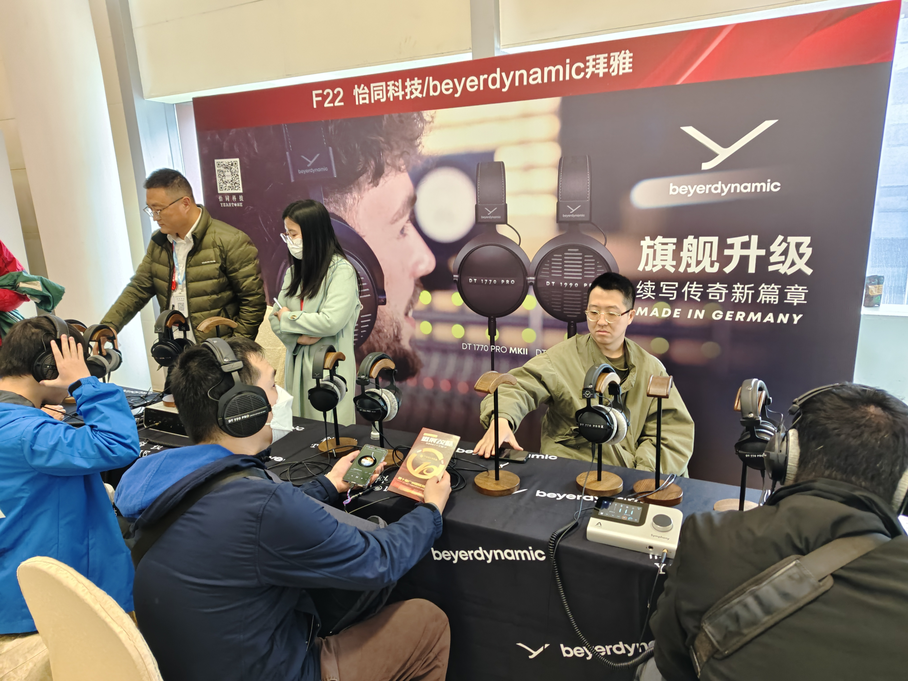
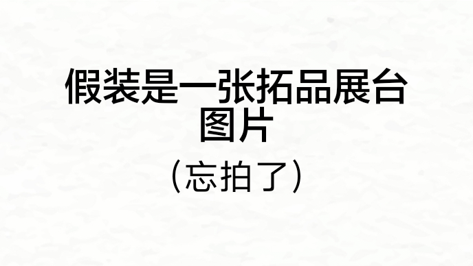
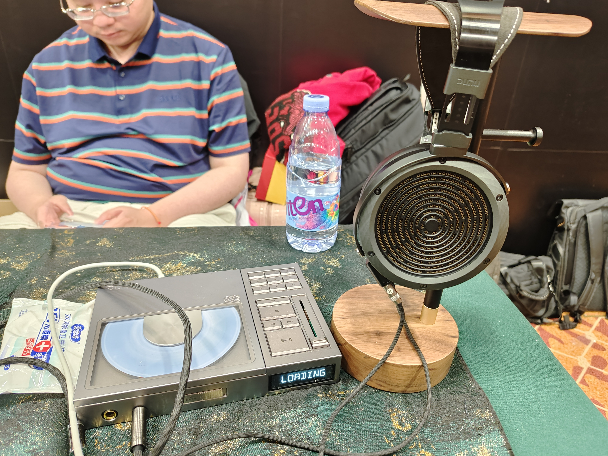
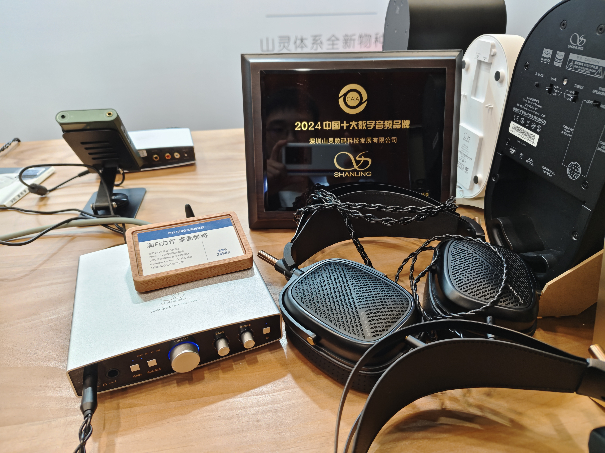
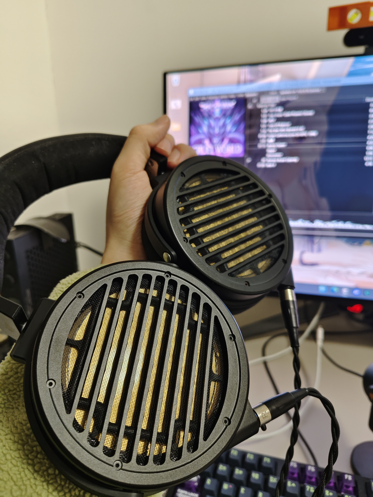

请将这篇有关 HiFi 文化的文章翻译成英文，注重原意重现，不需要逐字逐句。请根据发烧友和耳机设计相关的英文词汇来翻译这篇帖子，比如“发烧友”应译作 Audiophile(s)，大耳指的是headphones，平板大耳指的是planar magnetic headphones，耳放指的是headphone amplifier……

```md
---

以下是我在展会上得到信息量较低但是值得一提的品牌，顺序是乱排的

# Beyerdynamic 拜亚动力



总代和二级代理也没有任何新旗舰的消息

# Topping 拓品



拓品正在声卡市场开卷，准备见证 HiFi 厂商的声价比对声卡厂商的降维打击吧。拓品还将推出音箱、耳塞、大耳等产品，具体信息暂不透露

# Dunu 达音科




达音科的旗舰平板大耳岚和 CD 机的外观设计都备受好评，但都比较重，也都贼贵。据赵工称达音科近期没有推出别的新品大耳的计划

# Shanling 山灵



山灵新品高灵敏度平板大耳 HW600，声音符合山灵一贯的“润 fi”风格，但未免太贵了

# TDKD/初心之声/月照/XK Audio


青岛 TDKD 是一家专门经销小品牌的代理商，会上展出了初心之声的 CS97 系列平板大耳、初心给月照设计的入门级动圈耳机以及胆匠蒂威的胆机和耳东声的多媒体音箱产品

初心之声是中国国家石墨烯创新中心孵化出的一家公司，初心本人以技术助理的身份主导一些耳机研发，可以从他在[耳机大家坛上的产品介绍](http://erji.net/forum.php?mod=viewthread&tid=2334345&highlight=%B9%FA%BC%D2%CA%AF%C4%AB%CF%A9%B4%B4%D0%C2%D6%D0%D0%C4%D7%F6%B5%C4%C7%A7%D4%AA%C6%BD%B0%E5%B6%FA%BB%FA%BB%B6%D3%AD%B4%F3%BC%D2%CA%D4%CC%FD%A3%AC%CC%D6%C2%DB)详细了解


“老板，幽韵带了吗？”  
“带了”，于是老板从身后掏出一只幽韵  
“你这幽韵挺能藏啊”



展会上忘了拍照，拿自己家里拍的凑合一下。关于幽韵的介绍可以参考我之前的帖子
```
