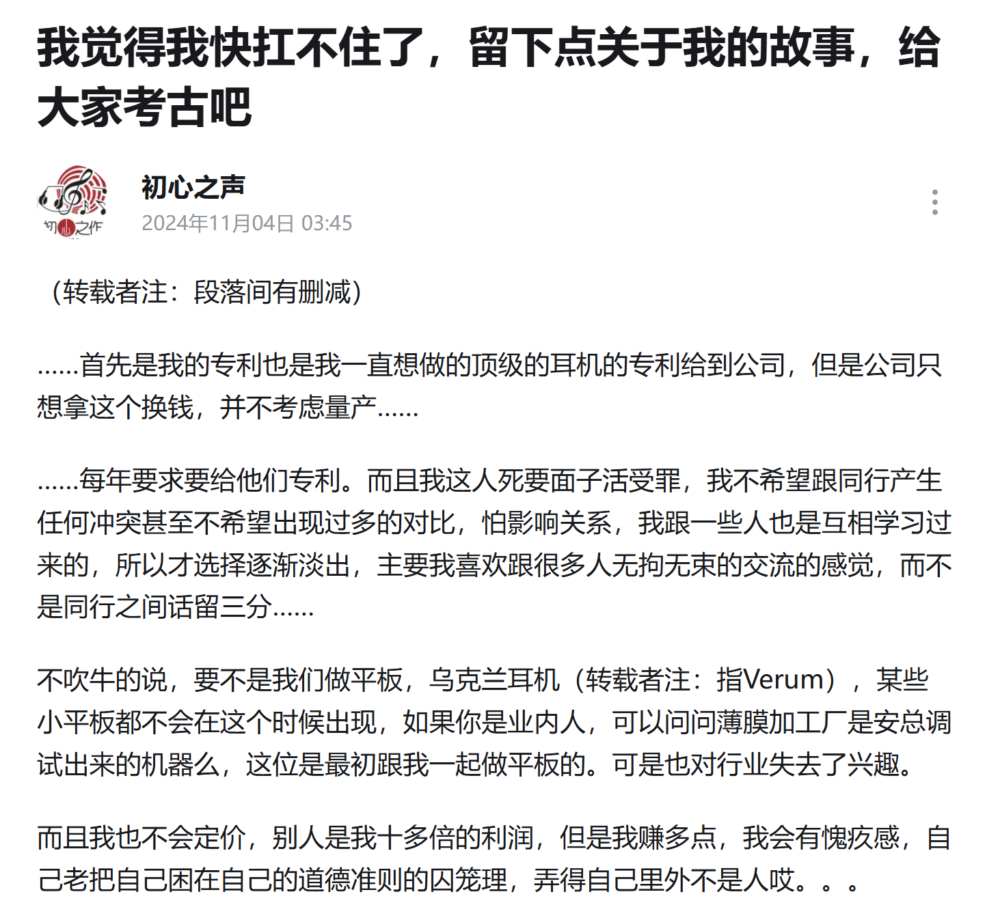

本文写笔者在广州中国国际耳机展，即 CIHE 的访谈和见闻，主要面向对 HiFi 产业比较感兴趣的烧友。你能从这篇文章中了解到很多一般消费者所不知道的，缩小和厂商的信息差。厂商的介绍顺序按知名度和影响力**升序**排列

# Hongshu Audio 虹曙音响/Binary Acoustics

虹曙音响目前只有一个产品，即虹曙 EH1，一款**售价 3000 左右**还附赠静电放，常年缺货的静电大耳，可以从[《介绍中国四大 diy 耳机作坊》](https://tieba.baidu.com/p/9070596414)这篇帖子简单了解下。这次展会 Binary Acoustics 展位上惊现 EH1 展机，我才知道这两个品牌本质就是一家；作为正经厂牌而不是小作坊式的 diy，虹曙的静电耳机系统研发大概是靠 Binary Acoustics 输血撑起来的

接上自带的“堪堪能响”的静电放，我戴上 EH1 十几秒就明显感觉到这是一种频响非常平直的声音，除了低频少一点其他频段几乎是贴着哈曼 2018 走。老板随即确认了我的听感符合客观测量结果，**主观对频响的判断与客观测量一致，则这款耳机具有低非线性的可能性很高**，说人话就是肉耳可闻的高素质、低失真。EH1 不仅声音深得我意，重量也非常轻，id 设计更是屌爆。在这种成本下做出这样水平的静电耳机，实在惊为天人

Reddit 上曾有几位海外烧友向我咨询购买 EH1 的事，我都劝退了，原因一方面是缺货，另一方面是前几批 EH1 稳定性堪忧，时常吱吱叫或偏音。但由于最新一批 EH1 是已经定型的最终版本，大大改进了稳定性问题，虹曙静电应该很快就能出海。要知道海外售后的成本是非常高昂的，一旦发生售后海外用户等待维修的过程也非常折磨，因此虹曙既然敢出口就说明 EH1 的耐用性已经达到了很高的水平。据称，**EH1 最终稳定版将于年底发售**，敬请期待吧

展后我得知虹曙还有一款静电耳放 EHA2T 和静电大耳 EH2 预计分别将于 25 年 Q2 和 Q4 发售，售价分别将是 4k 左右和 1w 左右。老板也坦诚地告诉我们 EH2 声价比不会高，但会在用料上尽可能豪华，“努力让买家不觉得怨”

不论 EH2 如何，反正 EH1 我本人是买定了，不过我或许会考虑用拓品的静电放而不是原装的

# Sonic Memory 声音记忆

声音记忆的代表产品 G50 是一款售价 299，一经发售就好评如潮，常态化脱销的封闭式监听耳机。其实我一开始是不信任这个听都没听说过的厂牌有如此成本控制能力能够在这种价格做出声音过得去的大耳的，但展会上这一听彻底打消了我的顾虑 —— G50 隔音性能优秀，声音中正还原，唯一美中不足的就是耳罩腔体小了点可能挤耳朵。G50 的 3.5mm 接口还有一个扭转卡扣的设计，这个设计结构简单、成本低廉却稳固，虽然弱化了接口兼容性，但不仅能够避免耳机线被轻松扯下来，还能非常牢靠地把自带麦克风固定在用户的嘴边，真正意义上回归了“监听耳机”首要的易用性要求

声音记忆的 boss 狗鞭向我解释道，他们作为上游厂商，不仅经营自有品牌，还同时有 to B 销售方案的业务，因此成本控制和研发能力都非常强。概括一下狗鞭的原话：“G50 这个耳机，换别的厂商可能卖 299 就没钱赚了，但我们卖这个价还能保证合理利润……G50 我们甚至是自己开的模，一下几十万投进去哪有小厂敢这么玩的。很多对耳机销量没有信心，就用公模先做个几十条卖几百块，卖完了再做个几十条大不了亏几万，这样规避风险……**国内有些出货也不算小的耳机厂商连正经声学研发条件都没有**……我们也可以考虑把 G50 的模具卖出去变成公模……出海是绝对能做的，但是国内 G50 需求太大，大耳生产周期还比较长，所以先得把国内需求满足了才能腾出产能来……我们对 G50 的宣发投入非常少，但一开始还是大大低估了 G50 的销量，几万条一下就卖空了……”

狗鞭还跟我聊了一些 G50 的设计，比如 G50 优秀的被动隔音性能来源于其彻底封闭的后腔和完全不打孔的耳罩。高保真封闭式耳机的设计很困难，因为后腔的声反射特征会对声音产生不利影响，所以比如飞傲 JT1、和声力黑洞等或多或少都使用了一些泄露的设计。然而，G50 没有对封闭性妥协，因此在将后腔盖板材质的声反射特征都纳入考虑后选择了开私模。在耐用性方面，虽然彻底封闭会导致捂住前腔的同时挤压耳罩容易损伤振膜，但目前 G50 的售后率仍保持在极低水准

我还向狗鞭询问声音记忆是否还有平板耳机的研发计划，狗鞭回复其实他们有在做平板耳机方案而且随时可以投产做产品，但声音记忆暂时不会考虑出平板耳机，因为他认为平板耳机的声音暂时还没能达到类似动圈的“正确”听感（这个观点我不赞同）。狗鞭还谈了他的产品理念和规划：“我们对自己产品的要求很高，绝对不将就。但是别的厂商买我们方案的话我们就不会那么严格了，以满足甲方为主。”狗鞭还带来了一款即将发售的，可以通过旋转后盖来实现切换开放式和封闭式的监听耳机 GO50（但我咋一听没听出来拧不拧盖子对声音有啥影响），价格仅 399；另还有一款木碗动圈大耳在研发中

我来声音记忆展位时，碰巧遇到狗鞭在和另一位烧油聊蓝牙大耳。狗鞭拿出一条 Beat Studio Pro，说这玩意虽然频响抽象，降噪一坨，但保证了结像准确，音质远胜索尼 XM5 之类以 ANC 为核心竞争优势的大耳。于是我接茬向他请教“Bose、索尼、苹果在消费级旗舰 ANC 蓝牙大耳领域的竞争力是否真的对国产蓝牙大耳形成了壁垒，还是说他们单纯只是占着品牌粘性和名声卖得贵而已？”“非常遗憾，确实有壁垒。”狗鞭解释说，“比如 AirPods Max 的 ANC 芯片，其规模近乎达到了当年 iPhone 4 soc 的级别。别说 HiFi 厂商，就连大多手机厂商都不具有那种设计能力，因此国内 ANC 再贵也只能买到高通方案，虽然性能也算优秀，但和御三家的实力根本没有可比性。声音记忆暂时也没有蓝牙大耳的计划”

声音记忆展位的信息量非常大，**非常感谢狗鞭作为上游厂商愿意和我这种普通烧友畅谈一些只有业内人士才能了解到的信息**。行业的良性竞争离不开他们对抹平消费者与厂家信息差的贡献

# Fosi Audio 弗西音频/MAMORITAI

我第一次见到 Fosi Audio 是在今年 9 月的深圳 SIAS 耳机展上，不过参展的几个年轻人都是市场部的，而我当时对技术层面的东西更感兴趣，因此没有太多有效的交流。于是展后我专程去了一趟 Fosi 深圳总部探访，详细了解了一些诸如产品规划、定价策略、营销策略等方面的信息。有一些需要保密，我挑公开的讲

Fosi 在本次 CIHE 第二次展出了其平板大耳原型机 i5，但由于这款耳机的形制与初心之声（初心之声在文末介绍）的 CS97 系列不说完全没区别，至少也是基本没区别，所以我当时还以为是他们是初心之声的代理商。直到这次展会前 Fosi 的一位运营告诉我这款大耳是他们自家产品，再联系起初心之声在 B 站发的近况，我才搞明白 i5 这款大耳的来历……

具体情况应该是初心之声开发出一款高性能平面磁单元交给公司，但公司没打算量产，于是就把单元专利卖给了 Fosi，Fosi 再用这个单元做了自家第一款平板大耳 i5。由于展会上的几个 i5 或多或少都有点小毛病，我就没太仔细听，感觉总体声音框架是走的我喜欢的中性低染的风格

上图中 Fosi 刚刚发售的一款重磅产品是售价 1099 的桌面解码耳放 K7，这玩意的外观和交互设计思路比较像游戏声卡，但核心目标受众仍是 HiFi 烧友，因此电声性能指标仍是第一位的（别真拿创新之类的东西碰瓷）。据参展人员介绍，这是“Fosi 第一款拿得出手的桌面解码耳放”，比起隔壁 F 厂的 K7 多了麦克风输入和控制的功能，对于 HiFi 和电竞兼修玩家非常友好。许多经销商比如戈声在展会现场就表达了对这款解码耳放的兴趣，不过比起 K7 预计将引发的强烈市场反响，它的产能应该还比较有限，所以宣发还没铺开

Fosi 的品牌定位是“以无与伦比的价值定义 HiFi”（简称超高性价比），但旗下还有一个高端子品牌名为 MEMORITAI。该品牌目前只有一款产品，一款售价 1w 的单端纯耳放 Euphony（即上图镜面那个）。Euphony 不仅使用了昂贵的镀铬镜面外壳，其内部电路之精致密集也是让烧友脑放拉满，没有走 dCS 和享声那些 Hi-End 产品使用 HiFi 空气调音的路线。根据客观测量数据和参展人员的介绍，Euphony 并没有追求多好看的电声测量指标，而是有意进行了一些优化听感的调音

我个人觉得这个产品基本是在浪费研发和开模成本

我非常确定的是，Fosi 将会很快成为国内外 HiFi 圈一股重要的新势力。两次展会的交流和一次线下探访经历让我确信这家公司具有极强的成本控制能力，研发和营销水平也有大厂风范。据悉 Fosi 不仅规划了 CD 机等等拓宽产品线，还可能推出运放芯片这种中间元件给核心发烧友提供更多玩法，**难怪 Fosi 众多产品在国内外能收到科 hi 和老烧难得的一致好评**。根据我对 Fosi 产品的浅薄了解，私以为 Fosi 目前对市场需求的分析理解还可以提升，听说他们新招了一名大厂出身的产品经理，希望能补上这最后一块短板

# Aune 奥莱尔

我不是第一次听奥莱尔的两款动圈大耳 AR5000 和 SR7000 了，这两款大耳不仅 id 设计水平惊为天人，其客观声学还原性能、烧友对其的主观音质评价、佩戴舒适度以及易驱动性也都非常优秀。一位没条件试听的俄留烧油也是在我安利下盲狙了 SR7000 且对其评价颇高（唯一一点缺憾就是被动隔音一般）

奥莱尔是发烧友的公司，这次算是领教到了：我拿出 Kennerton 的封闭动圈 Magni 给一位参展人员听，研发一耳朵就发现 Magni 偏音（很轻微，在展会那种嘈杂环境下很不明显），而且对 Magni 和 nan7 的声音和调音思路分析得非常有见解。参展人员还向我介绍了封闭大耳 SR7000 后腔的“龙鳞”结构：**SR7000 的后腔采用了密集的间隙不一的刚性吸音结构，而非传统封闭式中常见的类海绵材料来避免闷罐声和提高一致性**（好像还有什么因素来着但我忘了，奥莱尔的大佬可以来评论区补充下）。结果就是，**SR7000 的声场自然程度出类拔萃，非一般封闭式耳机可以比拟**

AR5000 和 SR7000 这种素雅的音色，本质上是较低的失真和相对平直的频响带来的。如今年轻人的第一幅耳机往往是一些调音比较放飞、失真非常显著、追求丰富音染带来的目标听感的消费级蓝牙耳机或廉价平头塞，甚至包括大多数发烧友也极其缺乏现场或监听环境下对真实声音的体验，大家都早已听惯了失真。在多数 HiFi 厂商习惯通过调整音染来为耳机做出各种味道的大环境下，奥莱尔反其道而行，回归原教旨主义 High-Fidelity 的调音还是非常值得烧友们一试的

我还向奥莱尔的参展人员询问了他们未来的研发计划，得知他们已经有在立项开发平面磁和静电架构的大耳，不过预计下一款 xRn000 推出也至少要到明年二季度左右了。我个人拙见奥莱尔在用 AR5000 成功打响自家大耳**好听好看好推高性价比**的口碑后，突然整出个四开头的 SR7000 在市场战略上确实值得商榷。虽说封闭式动圈的研发难度确实比开放式更高，而且 SR7000 应该也用了比它的前辈档次更高的单元，但复用 id 复用前腔复用模具的制造成本怎么说应该也高不到哪去，卖四千多确实有点过了。但可悲的是，**四位数以内无论是声音、佩戴还是颜值我又找不到能和 SR7000 一战的封闭大耳**，Z1R 和 HD820 这两款封闭旗舰从 ID 用料来看成本应该是比 SR7000 高，但声音素质比不上后者，或许这就是 SR7000 如此“自信”定价的来源吧……

“可别在贴吧黑我们了噢！”  
“产品实力黑不了，放心吧。”

# Moondrop 水月雨

<!-- 监听耳机调音的问题，para和别的监听耳机的对比，这里不知道有没有篇幅去写 -->

水月老板真是大明星啊，周围一直有人围着要签名留影啥的，展会上本内向患者虽然挺想请教但不敢去插话 😭

SIAS 展上和水月老板聊了挺多，这次 CIHE 展则主要和水司市场部的侯老师聊了一些（侯老师太谦逊了，给我整得有点不好意思），本文就合在一起讲吧

水月雨的平面磁耳机产品线自诞生以来就饱受非议。我第一次听 Para 的时候对声音的审美还没怎么建立就急着写评测，只觉得它声场拥挤声音无趣；发烧一年多后再来听水月雨那几个音色相仿的平板大耳，却又感到这种纯净无染声音的好了，对其的评价也从“没有声场的无聊庸作”转为了“平直真实的原声重现”~~，虽然主观上感觉声场还是一般~~

在第一款水平板 Venus 因重量受一些诟病后，其后继者 Para 和 Cosmo 通过腔体和单元一体化装配设计（CN218450473U）减轻了一些重量；但由于水平板的设计理念就是用巨大的单元有效驱动面积降低失真，大量的磁铁是刚需，目前在产的两款水平板仍没能做到一斤以内

出于个人对耳机重量的敏感，我向侯老师询问“既然在 Para 和 Cosmo 之间定价空间还大有可为，那水月雨是否可能通过阉割一点单元配置之类的方式来推出几款更轻的平板大耳？”侯老师的解释是，成本、音质、重量三者不可兼得，而水平板的核心追求是极高的声价比，客观上不得不做一些取舍；另外水司发展状况优异，不至于、不会也不屑去做一些简单阉割就拿出来换个皮卖这种太 low 的事情。类似地，在 SIAS 展上，水老板曾向我展示了一个用碳纤维打的 Cosmo 外壳样品，高强度轻量化的材质能减轻许多重量，但消费者不一定会为增加的成本买单

两次展会上，我还都分别问了水总和侯老师关于水平板耳罩的问题，提到了 Cosmo 早期批次耳罩显著比后期批次薄，耳罩表面的皮材质比其他一些耳机用的皮材质更容易发出打滑噪音，且相对较硬导致夹紧力不甚均匀的问题。我觉得这些问题可能是耳罩设计更重视良好佩戴下的声学性能而较少考虑了对不同头型尤其是小头密封性和压力分布情况导致的。值得一提的是，广州展上别的友商也聊到了水平板耳罩的供应

水平板的耳罩都是磁吸的。据水老板介绍，耳罩上的铁片本身并不具有任何磁性，只利用了单元的漏磁来吸附，既不影响磁场，气密性和更换便捷性也相当好，可以说是非常优秀的设计了。对于薄薄的平板耳机而言，耳罩就是腔体，是最重要的调音方式之一，我相信水司如果能提供一些可替换耳罩作为可选配件，一定会很受烧友们欢迎

我也很期待水月雨能在坚持其一贯的低非线性风格的同时，更多考虑重量敏感用户的需求，推出新的耳机产品。虽然他们应该还没这计划，但这绝不是不可能，毕竟**水司研发团队的规模和实力在国内 HiFi 厂商里绝对算数一数二**了

# Fiio 飞傲

**飞傲是我最喜欢的 HiFi 品牌。** 这次飞傲端出来的我感兴趣的新品主要就是封闭木碗 FT1、平板大耳 FT1pro 和还在调音的 FT7，另外也受众群友之托来体验下备受关注的解码耳放一体机 K17

FT1pro 和 FT1 的关系不能说一点没有，只能说“如有”，一个开放平板一个封闭动圈，共同点只是几个结构件和头梁耳罩而已，没啥好比的。主观上，FT1pro 的声音比较像低频多一点解析高一点的 HD650；FT1 则无疑是 2000 以内封闭式大耳的王者。FT7 的调音尚未完成，因此主观听感意义不大，但可以确定的是这个耳机采用了高度开放的后腔设计，这是由于耳机振膜相当薄，对后腔声反射非常敏感（和 Hifiman 最近在炒的 Unveiled 概念是一回事），也因此前腔耳罩采用了密集打孔的设计

FT7 非常重视轻量化，在大面积驱动的情况下仍做到了 400g 左右的重量，非常难得。从碳纤维头梁也看得出飞傲这回在材料上下了血本，只是头梁连接部分用碳纤维和塑料组合总感觉有点违和，滑动阻尼也稍有不顺，希望正式版本能参考 YH5000se 等在设计有相似之处的前辈进一步优化

K17 是飞傲的次旗舰解码耳放，但是比 K19 增加了流媒体输入和触屏控制的功能，外观也更“尊”更复古了，定价我预计在 5999 左右（好笑的是由于这个外观太传统，我见到很多烧友以为 K17 是作为 K19 的上级产品要卖 1w 左右）。在嘈杂的展会上肉耳分析大推力石机的声音意义不大，因此这里就暂且不谈声音

我上手掂了下飞傲的入门台式解码耳放 K11 和 K11 r2r，明显感觉到 r2r 版本要沉一截，飞傲硬件部任工说这是因为 K11 r2r 在 K11 的基础上额外叠了一块 r2r 解码板。上次 SIAS 展后市场部 Matt 大佬告诉我 r2r 销售成绩非常好，飞傲未来很可能会考虑给 K1x 系列台式解码耳放应用 r2r 技术，但这次展会上任工提到如果要为 K17 等更高端型号推出 r2r 版本，还需要等飞傲研发取得一定技术突破，做出更高端的 r2r 解码才行。我个人其实不太理解为什么 2024 年的发烧友喜欢逆时代发展去追求这种已经被集成 Sigma-Delta dac 淘汰的技术，但我猜既然市场反馈良好，飞傲推出更高端的 r2r 解码基本也是板上钉钉了

飞傲是成熟的 HiFi 大厂，展厅也是大厂风范 —— 产品类目齐全、秩序井然。据老板 James 的规划，飞傲的目标是成为 HiFi 界的迪卡侬，通过严格的成本控制达成高性价比，以出众的用户体验形成品牌粘性，成为一站式的 HiFi 厂商。这点也体现在飞傲入局胆机、台式数播、便携 CD、黑胶甚至收音机这种小众市场的规划中。同时，飞傲也在尝试在传统产品中加入创新设计，比如在最新的解码产品线中加入 ADI 的 dsp 芯片以满足玩家个性化的调音需求

不过，还是要批评下这个 dsp 软件的可用性。Fiio dsp 的 UI 过于专业，后果就是大多数烧友一看就知难而退。另一方面，现在烧友即使要 EQ 大多也是基于耳机频响直接导入预设的 dsp 配置文件，比如从 AutoEQ 或 Oratory1990 下载 EQ 文件导入 EqualizerAPO，其实没有什么学习门槛；但 Fiio dsp 一方面没有各大调音数据库的 API 和格式支持，也没有转译 EqualizerAPO 配置文件的工具，非专业音频工作者除了简单拉拉曲线根本无从下手去精细调整，这可能也是发烧友们对这项王炸级功能热情不高的原因之一。另一方面，即使 Fiio 社区刚好有你在用的耳机的 EQ 预设，下载、导入、调用、切换配置也不太方便。除此之外 Fiio dsp 还有太多优化空间和应用场景，这里篇幅有限无法多写；给解码加上一颗简单的 dsp 芯片可以产生无限可能，但飞傲目前还只发掘了其最表面的一小部分，**希望随着软件更新、未来与调音社区可能的合作以及飞傲自身的电声研发能力进步，我们能看到 dsp 在飞傲的产品中取得更好的应用甚至生态**

---

以下是我在展会上得到信息量较低但是值得一提的品牌，顺序是乱排的

# Beyerdynamic 拜亚动力

总代和二级代理也没有任何新旗舰的消息

# Topping 拓品

拓品正在声卡市场开卷，准备见证 HiFi 厂商的声价比对声卡厂商的降维打击吧。拓品还将推出音箱、耳塞、大耳等产品，具体信息暂不透露

# Dunu 达音科

达音科的旗舰平板大耳岚和 CD 机的外观设计都备受好评，但都比较重，也都贼贵。据赵工称达音科近期没有推出别的新品大耳的计划

# Shanling 山灵

山灵新品高灵敏度平板大耳 HW600，声音符合山灵一贯的“润 fi”风格，但未免太贵了

# TDKD/初心之声/月照/XK Audio

青岛 TDKD 是一家专门经销小品牌的代理商，会上展出了初心之声的 CS97 系列平板大耳、初心给月照设计的入门级动圈耳机、XK Audio 的幽韵等产品

初心之声背靠中国国家石墨烯创新中心，初心本人以技术助理的身份主导一些耳机研发，可以从他在[耳机大家坛上的产品介绍](http://erji.net/forum.php?mod=viewthread&tid=2334345&highlight=%B9%FA%BC%D2%CA%AF%C4%AB%CF%A9%B4%B4%D0%C2%D6%D0%D0%C4%D7%F6%B5%C4%C7%A7%D4%AA%C6%BD%B0%E5%B6%FA%BB%FA%BB%B6%D3%AD%B4%F3%BC%D2%CA%D4%CC%FD%A3%AC%CC%D6%C2%DB)详细了解

“老板，幽韵带了吗？”  
“带了”，于是老板从身后掏出一只幽韵  
“你这幽韵挺能藏啊”

展会上忘了拍照，拿自己家里拍的凑合一下。关于幽韵的介绍可以参考我之前的帖子
